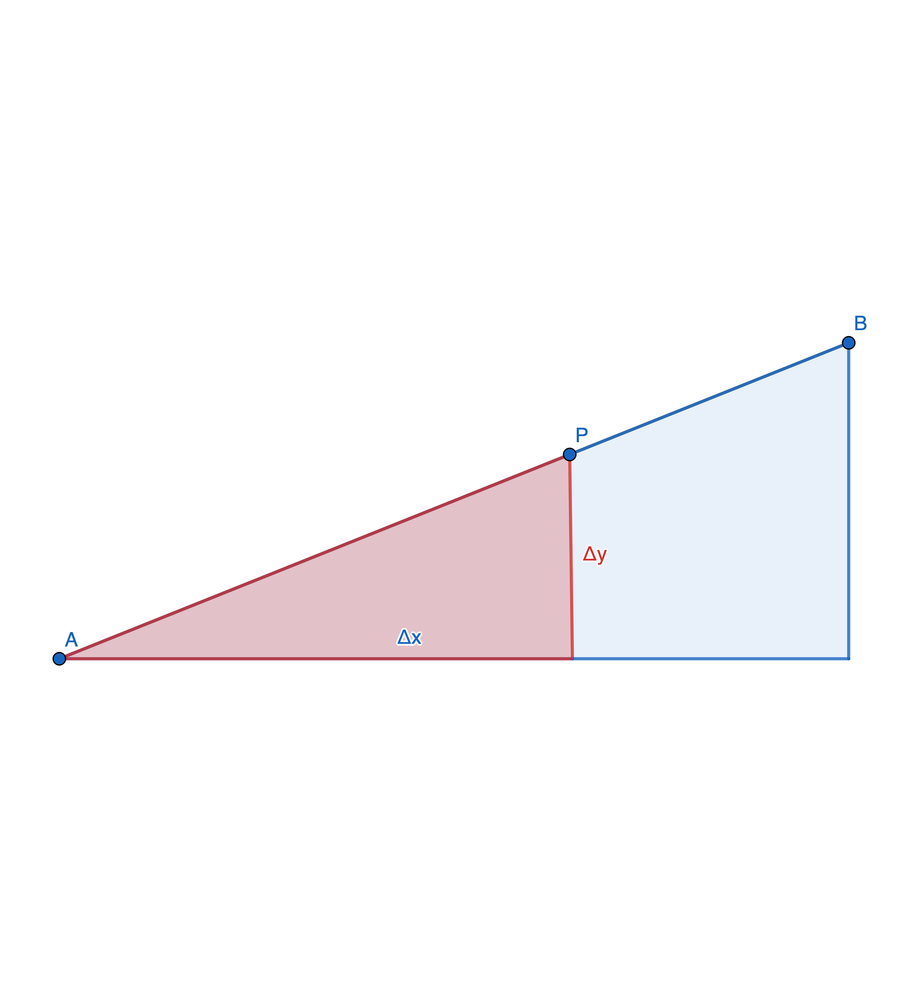

# 计算边缘距离

> org.locationtech.jts.algorithm.LineIntersector

判断两条线段是否相交有以下几种可能：

* NO\_INTERSECTION - 线段未相交
* POINT\_INTERSECTION - 线段相交于一个点
* COLLINEAR\_INTERSECTION - 线段共线，它们相交于一个线段

当两个线段相交于一点时，有以下两这可能：

* 点为端点
* 点同时在两个线段的内部

当符合第二种情况的时候，代表了一种适当的交叉。

 计算一交点$$P$$沿线段的“Edge Distance“，这个距离由一种具有鲁棒性并且简单的方法计算得来的点沿边缘的一种度量，与一般的欧几里得度量并不相等。

这种方法认为，边缘中的点的$$x,y$$坐标是唯一的，这时该度量由边缘在垂直和水平方向的较大值来决定。

