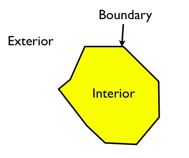
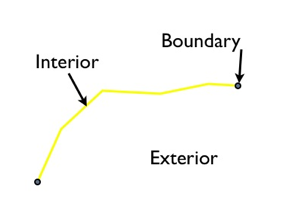
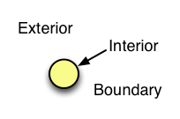
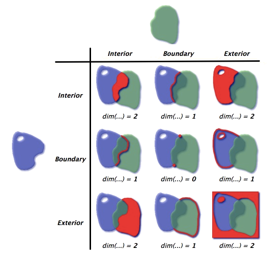

# 维度拓展的9交叉模型

### 空间属性

每个空间对象由以下三个空间属性描述：

* 内部
* 边界
* 外部

对于多边形，这些属性可以这样表示

对于折线，变得没那么直观

边界为折线的两个端点，内部为两端点间的部分，外部为除内部和边界外的其他部分。

对于点，内部即为点本身，点不存在边界，即边界为空集，，外部为点之外的所有部分。

使用这样的定义，一对空间要素间的空间关系可以由这三个属性间的相交关系中的九个可能的维度来描述。

### DE9IM定义

由以上三种空间属性，DE9IM的定义如下：

$$
\operatorname{DE-9IM}(a, b)=\left[\begin{array}{ccc}\operatorname{dim}\left(I_{A} \cap I_{B}\right) & \operatorname{dim}\left(I_{A} \cap B_{B}\right) & \operatorname{dim}\left(I_{A} \cap E_{B}\right) \\ \operatorname{dim}\left(B_{A} \cap I_{B}\right) & \operatorname{dim}\left(B_{A} \cap B_{B}\right) & \operatorname{dim}\left(B_{A} \cap E_{B}\right) \\ \operatorname{dim}\left(E_{A} \cap I_{B}\right) & \operatorname{dim}\left(E_{A} \cap B_{B}\right) & \operatorname{dim}\left(E_{A} \cap E_{B}\right)\end{array}\right]
$$

#### 模型布尔值定义

对于以下多边形间的关系，如下图所示：

内部相交为一个二维区域，矩阵中使用$$2$$来表示。当边界相交为一条折线时，矩阵中的$$(2,2)$$应该由$$1$$来填充，这里边界相交为点，是$$0$$维的，所以这里用$$0$$表示。当两部分没有相交时，矩阵中用$$F$$表示。

为应对更通用的模式匹配，还有

* “\*“ 这个位置为任意值都可以
* "T" 这个位置任意 non-false 的值都可以\(0,1,2\)

